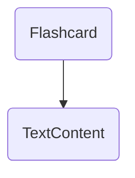
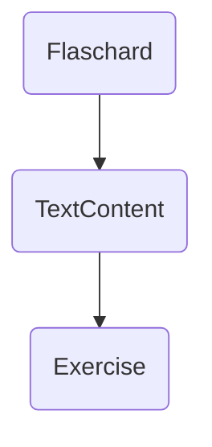
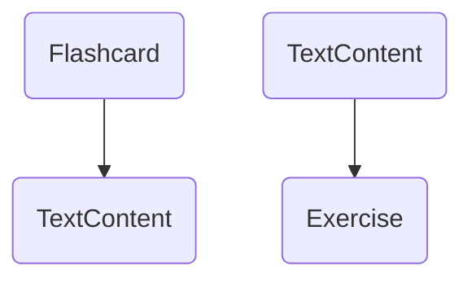

## Backend Architecture Overview

## Introduction
The backend consists of the following layers: 
- Controllers
- Services
- Repositories
- Repository operations
- Commands / Command Handlers
- VertexFactories
- Vertices
- ModelFactories

The controllers are responsible for translating DTOs to models and vice versa. 
The services are responsible for handling the business logic.
The repositories are responsible for handling persistance in the graph.
The repository operations are responsible for handling the graph operations per data subtype.
The commands/command handlers are responsible for handling one-off operations on the graph.
The vertex factories are responsible for creating vertices per data subtype.
The vertices are responsible for handling the graph representation of the data per data subtype.
The model factories are responsible for creating models from the graph representation of the data.

## Persistance 
All data in the system is store as a graph nodes and connections.

There are currently 3 different kinds of data: 
1. Concepts - Concepts contains metadata like language and grammatical terms
2. Content - Content contains displayable content in the UI
3. Exercises - Exercises contains 

The exact layout of the graph is described in graph-representation.md 

### Dynamic vs. static content 
The system operates with two types of content:
- Dynamic content - Content nodes that is mutable Its properties can be updated.
- Static content - Content nodes that is immutable. Its properties cannot be updated. 

The differentiation between dynamic and static content solves two design problems:
1. It is important to limit system complexity by limiting the number of nodes in the system.
2. It is important that once a piece of content is expanded upon (e.g. a exercise is created), the content should not be changed.

#### Mutation on dynamic content
The system updates dynamic content by updating the node properties.
Ex. The value of Flashcard side is changed by updating the text property of the TextContent node.

Befure/After update: 

#### Mutation on static content
The system updates static content by creating a copy of the existing node and updating the properties of the new node.
Ex. The value of Flashcard side is changed by creating a new TextContent node and updating the Flashcard node to point to the new TextContent node.

Before update: 

After update: 
