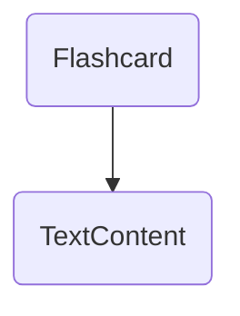
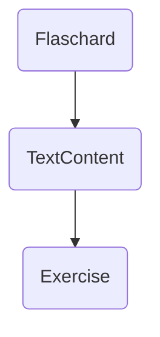
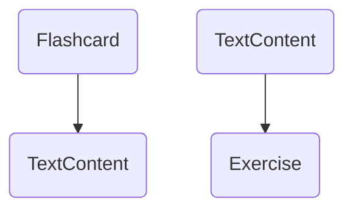

## Backend Architecture Overview

## Introduction
The backend consists of the following layers: 
- Controllers
- Services
- Commands / Command Handlers
- Queries / Query Handlers
- Helper Classes
- VertexFactories
- VertexBuilders
- Vertices
- ModelFactories

The controllers are responsible for translating DTOs to models and vice versa. 
The services are responsible for handling the business logic and orchestrating commands and queries.
The commands/command handlers are responsible for handling write operations on the graph (mutations).
The queries/query handlers are responsible for handling read operations from the graph.
The helper classes are responsible for shared logic between services (e.g., evaluation, configuration mapping, session management).
The vertex factories are responsible for creating vertices per data subtype.
The vertex builders are responsible for creating clusters of associated vertices.
The vertices are responsible for handling the graph representation of the data per data subtype.
The model factories are responsible for creating models from the graph representation of the data.

## Inter-layer communication
The different layers communicate with each other using models (located in /src/models). The models class names either end with "Model" or "DTO". Model indicates that the model is used internally in the system, while DTO indicates that the model is used for data transfer (e.g. between frontend and backend). NB DTOs must always be a flat data structure (JSON-like). DTOs are sometimes mapped to models, but only when necessary. Most of the time, DTOs are directly mapped to the graph representation, since this reduces complexity and improve traceability, performance and reduces the overall amount of code.

## Service Layer
Services contain business logic and orchestrate commands and queries. They:
- Validate input data (e.g., file uploads, required fields)
- Call queries to read data from the graph
- Call commands to mutate data in the graph
- Use helper classes for complex shared logic
- Handle file operations (via BinaryStorageService)

Services should NOT directly interact with graph vertices. All graph operations must go through commands or queries.

## Helper Classes
Helper classes provide reusable logic that would otherwise be duplicated across services:
- **ExerciseEvaluationHelper**: Handles exercise answer evaluation logic
- **ExerciseSessionConfigHelper**: Manages exercise session configuration updates
- **ConfigurationMappingHelper**: Maps between configuration DTOs and graph vertices

Helper classes may interact with graph vertices when needed, but should be focused on specific reusable operations.

## Persistance 
All data in the system is store as a graph nodes and connections.

There are currently 3 different kinds of data: 
1. Concepts - Concepts contains metadata like language and grammatical terms. These are generally not shown in the UI. 
2. Content - Content contains displayable content in the UI.
3. Exercises - Exercises contains displayable composition of content in the UI.

The exact layout of the graph is described in graph-representation.md 

### Initialization (first-use)
The system uses the command "reset-graph" to initialize the graph with the initial content. The command should be run once when the system is started for the first time.

The command internally uses builders to create the initial content.

### Dynamic vs. static content 
The system operates with two types of content:
- Dynamic content - Content nodes that is mutable Its properties can be updated.
- Static content - Content nodes that is immutable. Its properties cannot be updated. 

The differentiation between dynamic and static content solves two design problems:
1. It is important to limit system complexity by limiting the number of nodes in the system.
2. It is important that once a piece of content is expanded upon (e.g. a exercise is created), the content should not be changed.

#### Mutation on dynamic content
The system updates dynamic content by updating the node properties.
Ex. The value of Flashcard side is changed by updating the text property of the TextContent node.

Befure/After update: 

#### Mutation on static content
The system updates static content by creating a copy of the existing node and updating the properties of the new node.
Ex. The value of Flashcard side is changed by creating a new TextContent node and updating the Flashcard node to point to the new TextContent node.

Before update: 

After update: 

### Command/query separation
The system separates commands (operations that mutate the graph) and queries (operations that read from the graph). Both commands and queries are implemented so they are serializable.

**Commands** are used for all write operations:
- Creating new vertices (flashcards, languages, configurations, users, etc.)
- Updating existing vertices
- Deleting vertices
- Creating relationships between vertices
- Examples: `CreateFlashcardContentCommand`, `UpdateLanguageCommand`, `DeleteConfigurationCommand`

**Queries** are used for all read operations:
- Fetching single entities by ID
- Fetching collections of entities
- Searching and filtering data
- Examples: `GetFlashcardByIdQuery`, `GetAllLanguagesQuery`, `FindUserByEmailQuery`

**Command/Query Handlers** encapsulate the logic for executing commands and queries. They:
- Interact directly with graph vertices
- Validate inputs
- Execute graph operations
- Return appropriate models or DTOs
- Are autowired into services as needed

This separation ensures:
- Clear distinction between reads and writes
- Better testability
- Easier caching of read operations
- Cleaner service layer code 