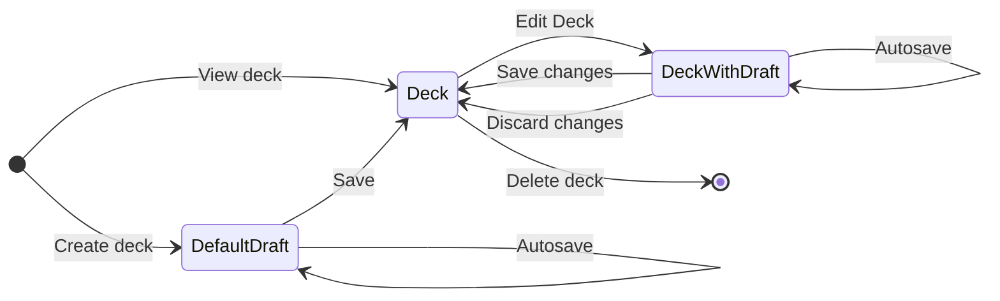

# General concepts 

## Content
The flahscard functionality provides the main content of the learning system (at the moment). The content consists of flashcard decks, flashcards and text content. 

### Flashcard decks

The flashcard editor allows for the creation of flashcard decks. 

## Content enrichment

### Generation of vocabulary 

1. The flashcard UI provides text content.
2. The word extractors extracts the words from the text content.
3. The words are accesible via the vocabulary UI.

