# Data Representation
This document describes the data representation used for the Tinkerpop graph. 

## Concepts
### Language
A language represents a common group of content and concepts, like words, text, pronunciation, etc. 
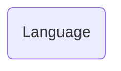

Properties:
- id: string
- name: string
- isoCode: string

### Word
A word represents an entry in a language's vocabulary in the system. 
The systems usage of word is analogous to a dictionary entry. 
A word may have multiple spellings, where each spelling is indicated by hasTextContent. 
A word may also have example of usage like a sentence or phrase, indicated by hasExample.  
A word may also have a pronunciation, indicated by hasAudioContent.

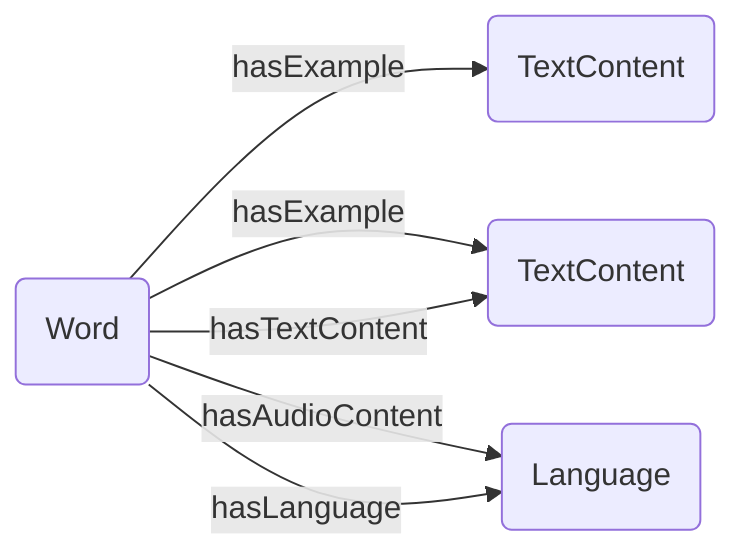

Properties: 
- id: string
- values: string[] (dictionary spellings of a word)

### Pronunciation
A pronunciation represents a single instance of a word's pronunciation in a language.
Mostly in the form of an audio file, but may also be represented as text.

Pronunciation for text content. 
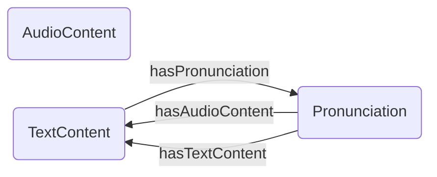

Properties:
- id: string

## Configuration 
### TextToSpeechConfig
Represents the configuration for Google Text-to-speech API.

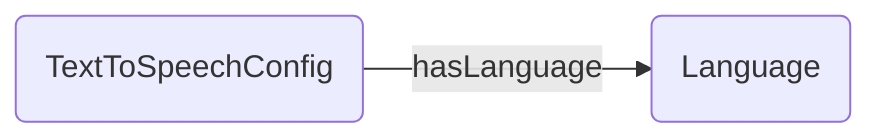

Properties:
- id: string
- languageCode: string
- voiceName: string

### SpeechToTextConfig
Represents the configuration for Google Speech-to-text API.

Properties:
- id: string
- languageCode: string

## Basic Content 
### Audio content
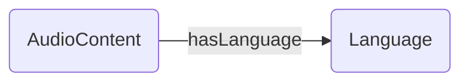

Properties:
- id: string
- url: string

### Image content

Properties:
- id: string
- url: string

### Text content

Properties: 
- id: string
- text: string

### Video content

Properties:
- id: string
- url: string

## Flashcard content
### Flashcard
A flashcard will always have both left and right content, however, they may be of different types.
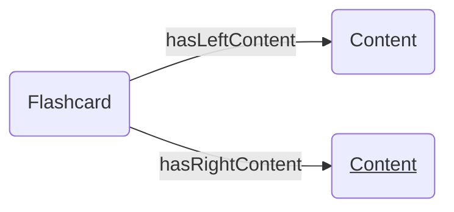

Flashcard properties:
- id: string

Allowed content types are:
- AudioContent
- ImageContent
- TextContent
- VideoContent

### Flashcard deck 
A flashcard may contain 0, 1, or more flashcards.
Each flashcard is ordered according to the order property located on the hasFlashcard edge.

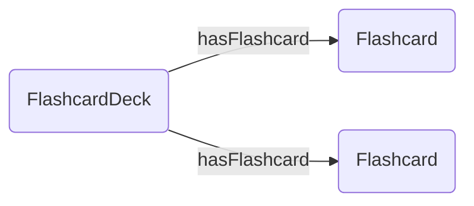

Flashcard deck properties:
- id: string
- name: string
- description: string

hasFlashcard properties:
- order: integer

## Exercise content
This section describes the components of an exercise. 
It first describes the overall relationship between exercises, exercise answers, and exercise sessions. 
Then it describes the different available exercise contents and inputs. 

Documentation for each of specific exercise type is provided in exercise-types.md.

### Exercise, ExerciseAnswer, ExerciseSession
This section describes the overall relationship between exercises, exercise answers, and exercise sessions.
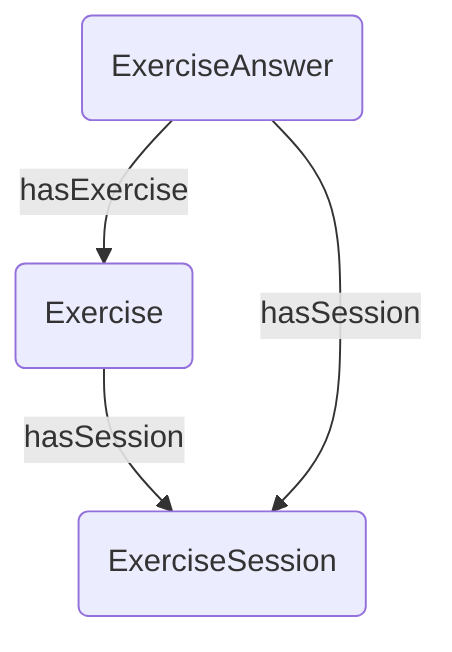

Exercise properties:
- id: string
- type: string

Exercise answer properties:
- id: string

Exercise session properties:
- id: string

### Exercise with Audio/Image/Text/Video Content
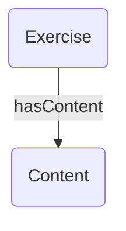

Exercise can by default have any basic content type. 
However, some exercise types may restrict the allowed content types.

### Exercise with Flashcard (Side) Content 
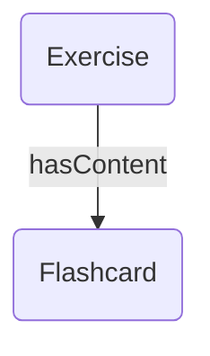

The flashcard content can exist in two forms: 
- A regular flashcard (two-sided) is indicated by the hasContent edge (without any flashcardSide attribute).
- A flashcard side (one-sided) is indicated by the flashcardSide property on the hasContent edge.

### Exercise with Select Options Input
This section describes the graph representation for the select-option input.

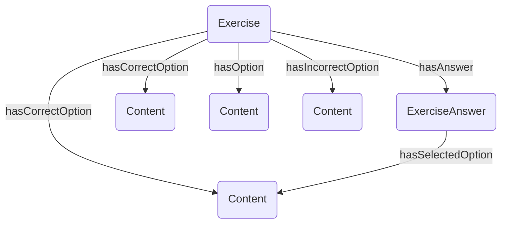
The allowed option types are: 
- AudioContent
- TextContent
- ImageContent

All options must be of the same type. Each option can either be correct, incorrect and undecided (indicated by hasOption). 

### Exercise with Recognizability Rating Input
This section describes the graph representation for the recognizability rating input.
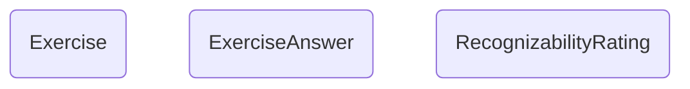

The available ratings are stored in code and are not represented in the graph.
The selected rating is stored in the RecognizabilityRating vertex.

### Exercise with Write Text Input
This section describes the graph representation for the write text input.
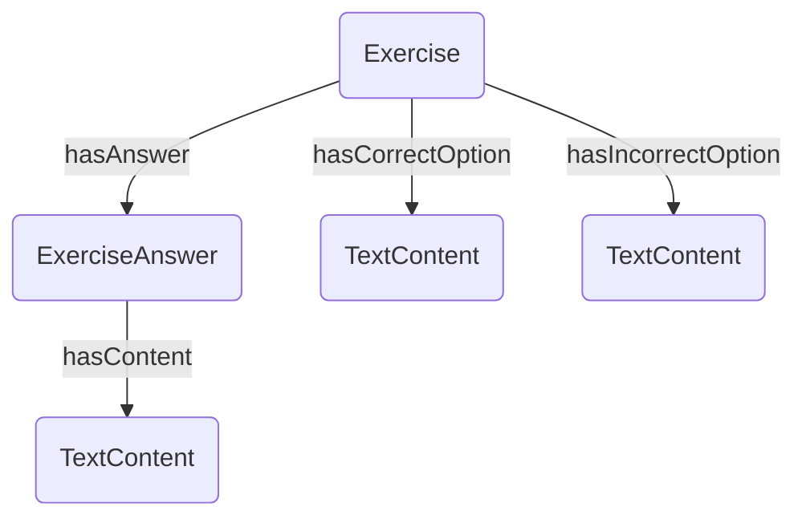
The correct option(s) represents a clearly correct answer to the exercise. \
The incorrect option(s) represents a clearly incorrect answer to the exercise. \
The actual answer will be stored in the ExerciseAnswer vertex.

NB, it is possible for an exercise to have no correct or incorrect options.