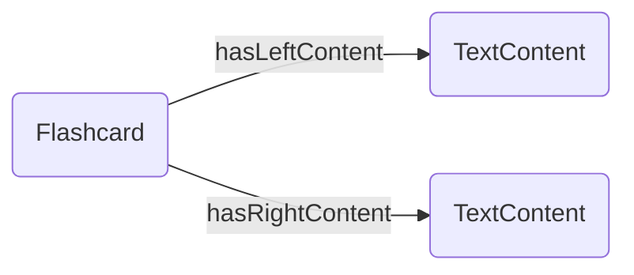
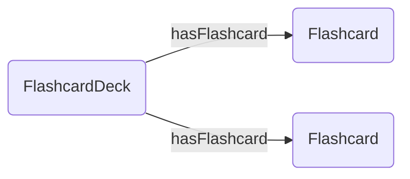
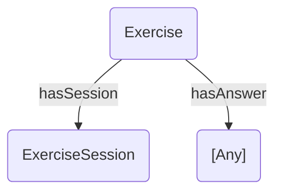
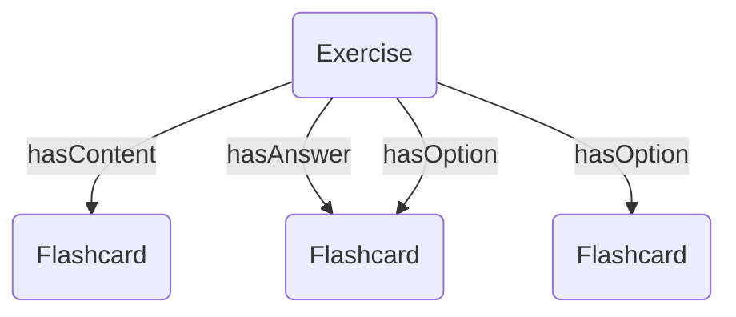
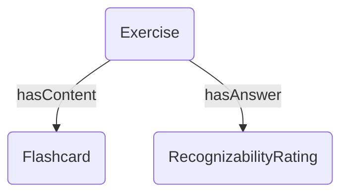
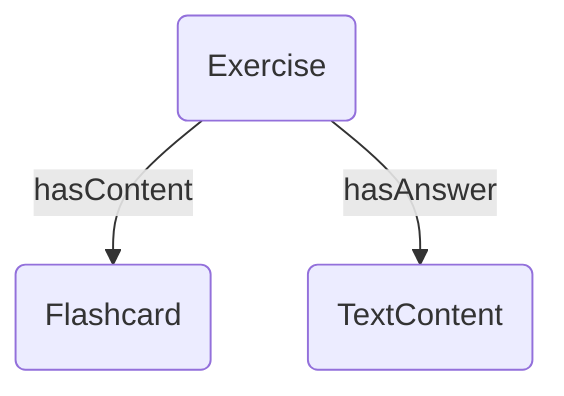
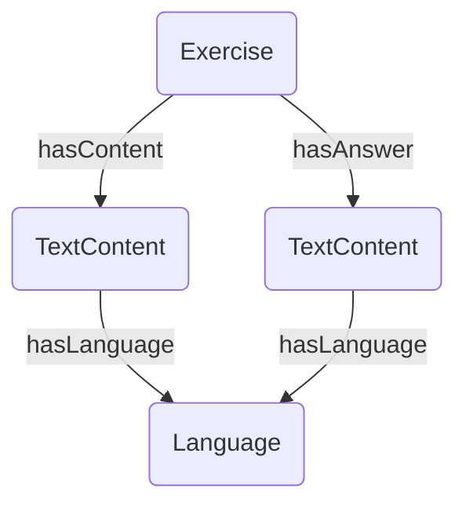
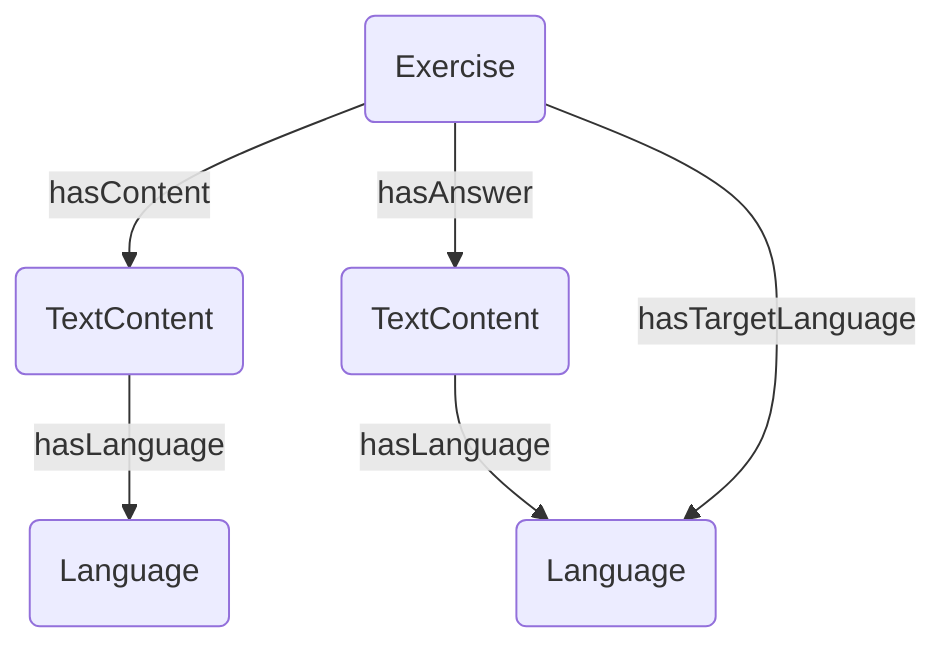

# Data Representation
This document describes the data representation used for the Tinkerpop graph. 

## Metadata
### Language

Properties:
- id: string
- name: string
- abbreviation: string

## Content 
### Text content

Properties: 
- id: string
- text: string

### Flashcard (with text content)

Properties:
- id: string

### Flashcard deck 

Properties:
- id: string
- name: string
- description: string

## Exercise
### General exercise 

Properties:
- id: string
- type: string

### Flashcard select exercise

Note, the content is also an option, the correct option. 

Additional exercise properties: 
- flashcardSide: string

### Flashcard review exercise

Additional exercise properties: 
- flashcardSide: string

### Flashcard write exercise 

Additional exercise properties: 
- flashcardSide: string

### Write sentence using word 

Additional exercise properties: none

### Write translated sentence 

Additional exercise properties: none
