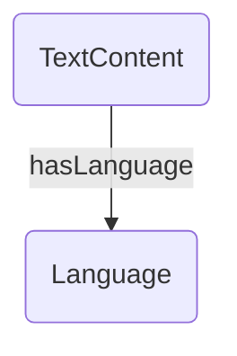
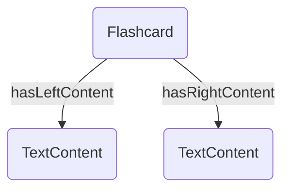
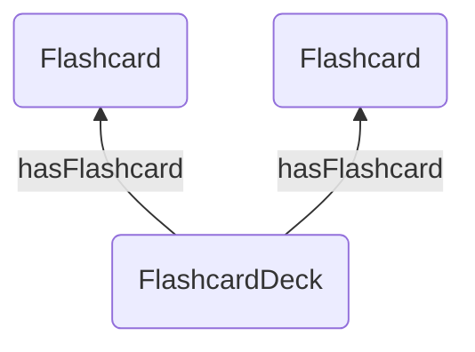
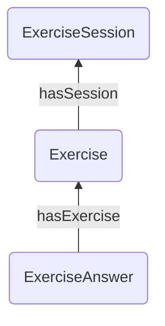
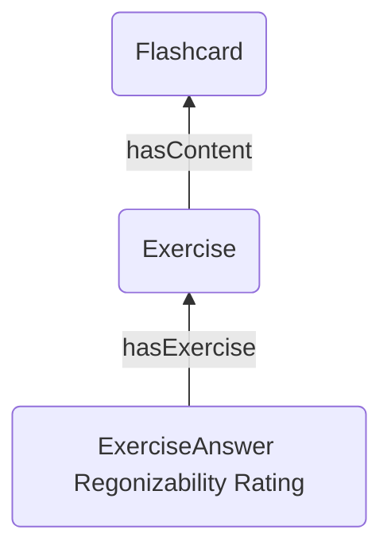
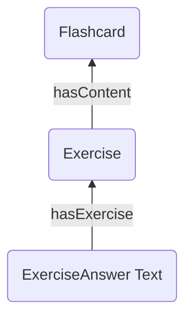

# Data Representation
This document describes the data representation used for the Tinkerpop graph. 

## Metadata
### Language

Properties:
- id: string
- name: string
- abbreviation: string

## Content 
### Text content

Properties: 
- id: string
- text: string

### Flashcard (with text content)

Properties:
- id: string

### Flashcard deck 

Properties:
- id: string
- name: string
- description: string

## Exercise
### General exercise 

properties:
- id: string
- type: string

### Flashcard review exercise

properties:
- [General exercise properties]

### Flashcard write exercise 

properties:
- [General exercise properties]

## Exercise answer

### General exercise answer

### Text exercise answer 

