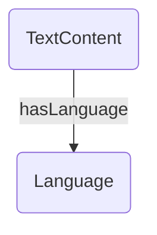
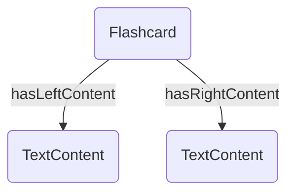
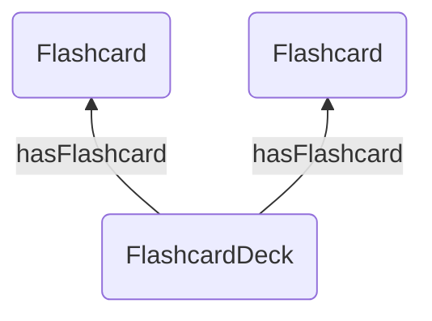
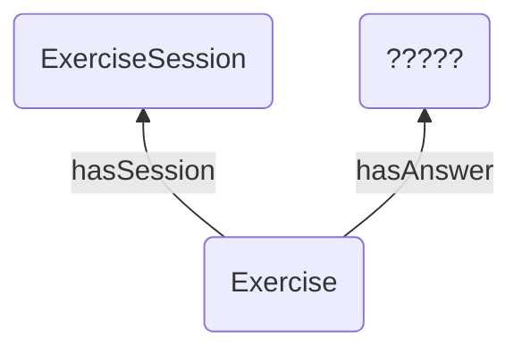
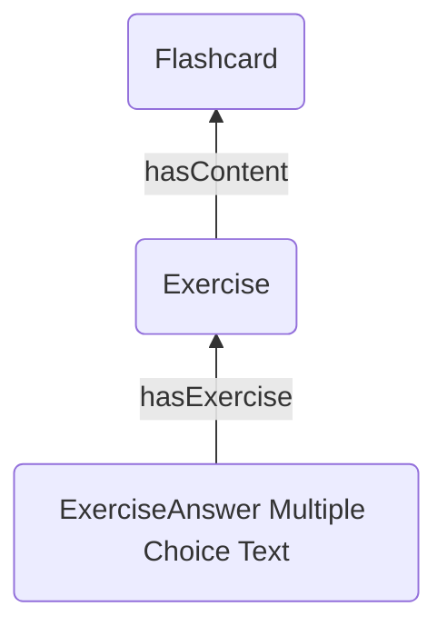
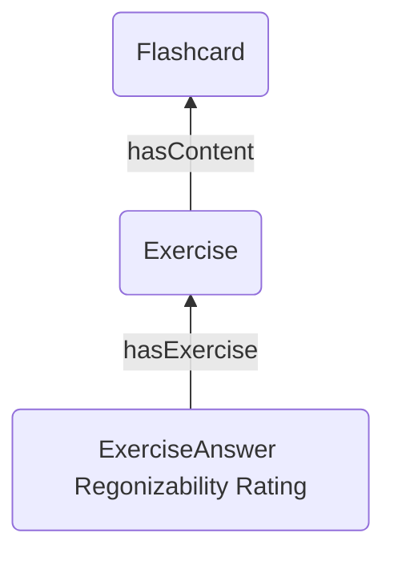
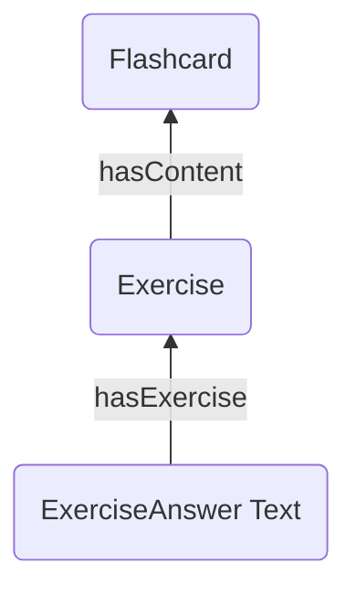
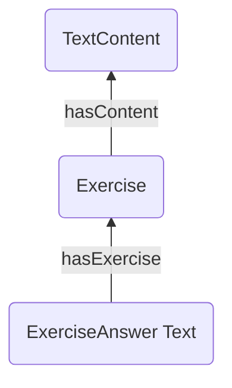

# Data Representation
This document describes the data representation used for the Tinkerpop graph. 

## Metadata
### Language

Properties:
- id: string
- name: string
- abbreviation: string

## Content 
### Text content

Properties: 
- id: string
- text: string

### Flashcard (with text content)

Properties:
- id: string

### Flashcard deck 

Properties:
- id: string
- name: string
- description: string

## Exercise
### General exercise 

Properties:
- id: string
- type: string

### Flashcard select exercise

Additional properties: none

### Flashcard review exercise

Additional properties: none

### Flashcard write exercise 

Additional properties: none

### Write sentence using word 

Additional properties: 
- targetLanguage: string

### Write translated sentence 

Additional properties:
- targetLanguage: string

## Exercise answer
### General exercise answer

Properties:
- id: string
- type: string

### Text exercise answer
Additional properties: none

### Multiple choice text exercise answer
Additional properties: none

### Recognizability rating exercise answer
Additional properties: none