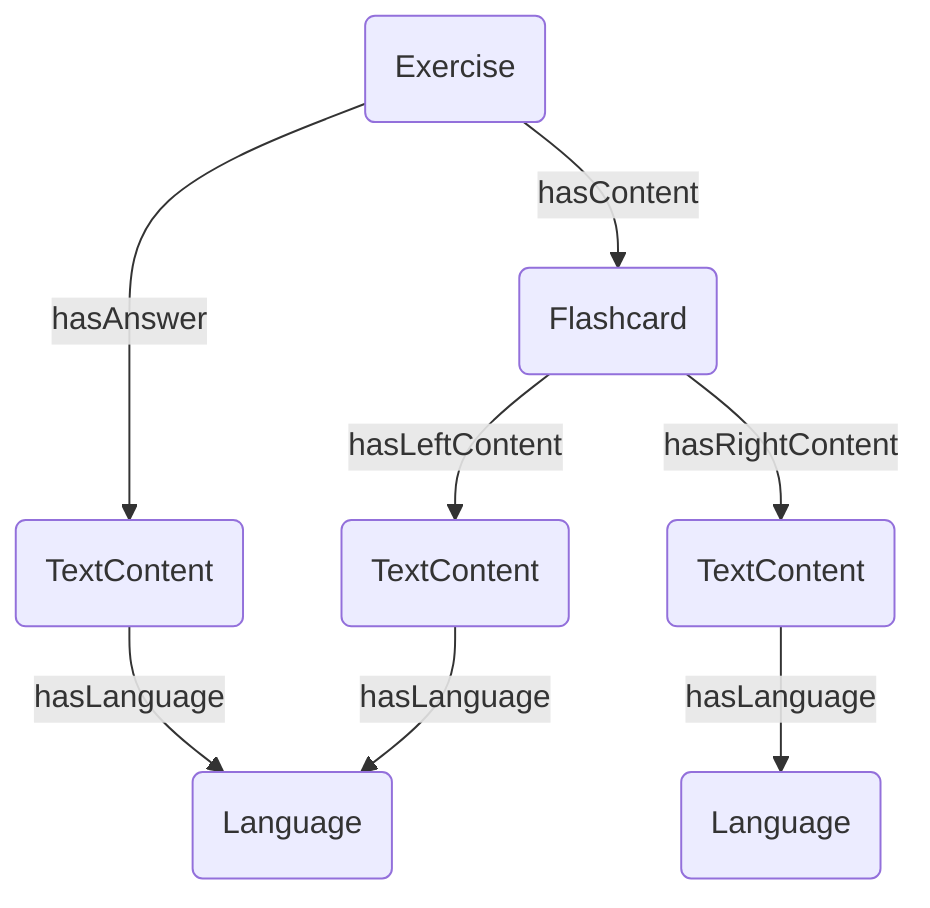

# Data Representation
This document describes the data representation used for the Tinkerpop graph. 

## Concepts
### Language

Properties:
- id: string
- name: string
- abbreviation: string

### TextToSpeechConfig

Properties:
- id: string
- languageCode: string
- voiceName: string

Represents the configuration for Google Text-to-Speech API.

### Word

Properties:
- id: string
- value: string

### Pronunciation

Properties:
- id: string

## Content 
### Audio content

Properties:
- id: string
- url: string

## Image content

Properties:
- id: string
- url: string

### Text content

Properties: 
- id: string
- text: string

### Flashcard (with text content)

Properties:
- id: string

### Flashcard deck 

Properties:
- id: string
- name: string
- description: string

## Exercise
### General exercise 

Exercise properties:
- id: string
- type: string

All exercise may have none or multiple answers. 
All writing exercises will have TextContent answers. All TextContent answers will have a Language defined by the exercise type. 

### Flashcard select exercise

Note, the content is also an option, the correct option. 

Additional exercise properties: 
- flashcardSide: string

### Flashcard review exercise

Additional exercise properties: 
- flashcardSide: string

### Flashcard write exercise 

Note, the answer will either have the same language as either side of the flashcard's content. 

Additional exercise properties: 
- flashcardSide: string

### Write sentence using word 

Additional exercise properties: none

### Write translated sentence 

Additional exercise properties: none
