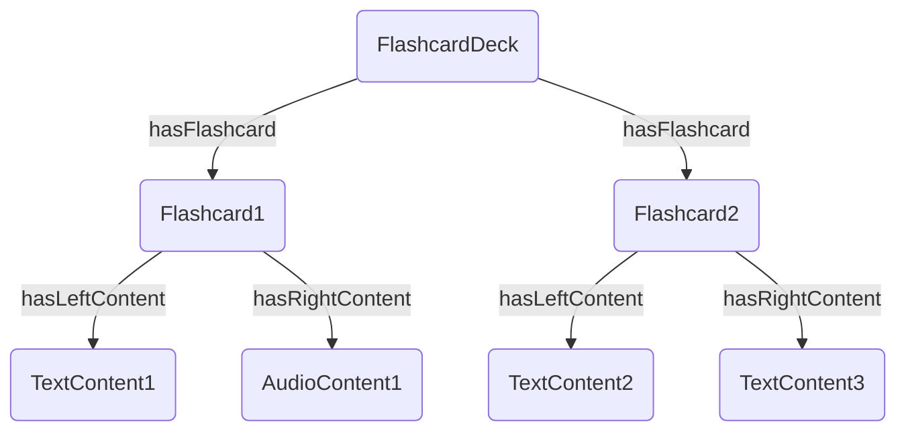
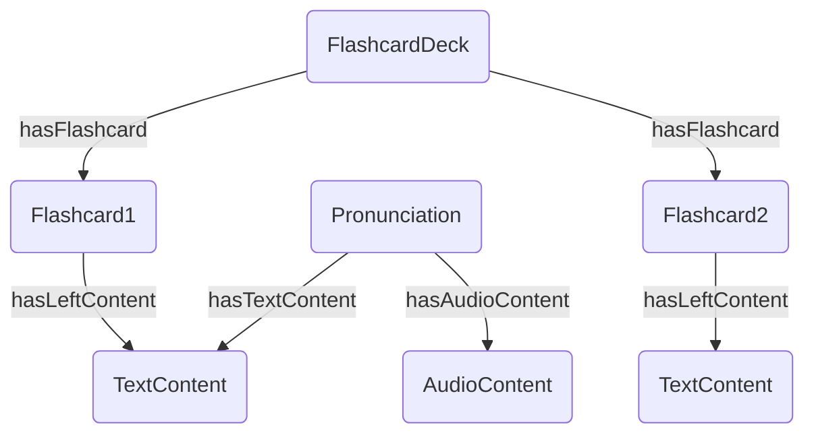

# The Orb Weaver Learning Algorithm Specification
The orb weaver learning algorithm is a spaced-repetition learning algorithm designed to optimize retention and learning efficiency by leveraging a content-first approach and encouraging active recall through testing and failure. This document outlines the principles, implementation details, and specific strategies used in the orb weaver learning algorithm.

## Introduction
The orb weaver algorithm is a spaced-repetition learning algorithm based on the idea of a spider web. Each piece of content is a juicy fly on the web. The learner crawls the web while balancing 3 competing priorities:
1. Immobilizing new flies 
2. Reinforcing the web around already caught flies as they loosen over time  
3. Reinforcing the web around partcicularly problematic flies before they destroy the web

### Beyond the forgetting curve 
Most spaced-repetion algorithms rely on estimating an appropiate delay period between reviews. This approach is nearly always based on the idea of the forgetting curve, which models the decay of memory retention over time. By interupting this decay with reviews, the forgetting curve model aims to optimize the timing of reviews to maximize retention while minimizing the number of reviews needed. In most algorithms (based on the forgetting curve), the next appropiate time for a review of an item is based on the performance in previous reviews for the same item. This approach assumes two things. (1) The retention of an item can be modelled separately from the other items. (2) The retention can be modelled based solely on the data available to the algorithm. These assumptions are at odds with the pricinples of this system, because this system allows 

The orb weaver algorithm solves these inherent issue by replacing estimation with testing. Testing is enabled by the data model, which handles all content as interconnected nodes on a graph. This interconnected web of content allows "retention difficulties" to ripple through. For example, let's say you ask someone to recall the danish translation of "to be" and you give them 4 options: "at være", "at gå", "vare", "at blive". If they pick incorrectly, you know they have not fully retained the translation "to be" - "at være". However, you can also infer that they also don't fully know the translations of the options as well, because they would most likely have mentally have excluded those options if they knew. This idea of inferring lack of retention can be expanded to include, lack of retetion of spelling in erronous pronunciation, lack of retention of grammatical gender in grammatical error, so on. Modelling every error type would be too complex, so instead, the orb weaver algorithm just prioritizes exercising regions of content that have a high error rate, regardless of the error type. To facilitate this, the learner must be given the oppurtinity to fail. 

### Failing fast 
A lot of language learning apps try to avoid failures by increasing the difficulty slowly. This gives a feeling of compentency and progress, but it also leads to slow progression and less effective learning. The orb weaver algorithm takes another approach instead of avoiding failure it encourages it by quickly ramping up the difficulty and then on failure it backs off and slowly builds up. In practice, this leads to the following exercise flow: 

1. Review flashcard ✅
2. Select flashcard ✅
3. Write flashcard ❌
4. Write flashcard ❌
5. Select individual parts of flashcard ✅
6. Write individual parts of flashcard ✅
7. Write flashcard ✅

This flow allows the system to quickly identify areas of difficulty, address these with additional practice and then move on. All the learner has to do is fail once in a while, so failure must never be punishing or discouraged in any way.

### Summary
The orb weaver learning algorithm is based on two interconnected principles: 
1. Testing and failing fast
2. Prioritizing content based on direct or indirect failures

## User experience 
The user experience can be separated into four different levels, a session, a batch, a round and an exercise. Each level has it's own dedicated purpose, but not all of them are directly visible in the UI. 

The purpose of a session is to help a learner progress in a particular area. For example, helping the learner memorize an entire flashcard deck. 

The purpose of a batch (or a session batch) is to help a learner make progress with specific pieces of content. The batching of content ensures that the learner is not constantly introduced to new content. Instead the learner gets a short periode of time to concentrate on a subset of the session content. A batch consists of a fixed number of exercise (by default 20) and a small amount of content. The amount of content is initially limited, but more progressively addeed if the user is doing well. The source of content in a batch is unpracticed content, insufficiently-practiced content and practiced content that has resulted in errors.

The purpose of a round is to split the batch content, so that the learner is practicing the same content in different ways 5 times over. For example, if a user is learning 3 words: apples, oranges and lemons. It is in-effective to show 5 exercises with apples, then 5 with oranges, and 5 with lemons. Instead a user should be shown one review exercise pr. word, then one select exercise pr. word, then one writing exercise pr. word, and so on. This variation in content ensures that the learner cannot fully rely on their working memory to complete the exercises. 

The purpose of an exercise is to practice one piece of content in one particular way. Ex. writing the content of a particular flashcard.

## Implementation 
The orb weaver algorithm is implemented as a session manager that orchestrates the learning sessions. The learning sessions is composed of exercise batches, which in turn are composed of individual exercises. The individual exercises on a content-first approach, meaning first the content is selected and then an appropiate exercise is created for that content. The content is selected based on the orb weaver principles outlined above. 

The life cycle of the orb weaver session manager is as follows:
```
Overall lifecycle: 
- Session
  - Exercise batches (incl. rounds)
    - Exercise

Life cycle:
- [Foreach Session]
    - Initialize session state via SessionStateManager[]
    - [Foreach exercise batch]
        - Fetch content via ContentCrawler
        - Dispatch content creation tasks from ContentCreationManager
        - [Foreach exercise]
            - Select most relevant content
            - Delegates exercise creation to ExerciseCreationManager 
            - Pass exercise to user
            - [Foreach exercise answer]
                - Evaluate answer via ExerciseEvaluationStrategy
                - Pass feedback to user
        - Update session state via state managers
```

To facilitate this life cycle, the following components are needed:
```mermaid 
graph TD 
SessionManager[SessionManager] --> StateManagers[SessionStateManager[]]
SessionManager --> ContentCrawler[ContentCrawler]
SessionManager --> ContentCreationManager[ContentCreationManager]
SessionManager --> ExerciseManager[ExerciseManager]
ExerciseManager --> ExeciseCreationStrategies[ExerciseCreationStrategies[]]
```

List of components:
- Content Crawler - Retrieves a subset of currently relevant notes to use in next exercise batch
- Content Creation Manager - Dispatches content creation tasks to appropriate content creation strategies 
- Exercise Creation Manager - Delegates exercise creation to appropriate exercise creation strategies
- Session State Manager - Manages session state updates after each fullfiled exercise, potentially including multiple answers and feedback loops

Design considerations:
- The orb weaver algorithm is content-agnostic and exercise-agnostic. The algorithm can be applied to any type of content as long as the content can be represented as interconnected nodes on a graph. The exercise creation must be content-dependent and the created exercises must be able to support the standard answers and feedback loops. 
- The orb weaver algorithm manages heavy or time-consuming tasks by implementing the exercise batch flow. Most heavy tasks are handled on the start of the session or at the start of an exercise batch. Option-source crawling for multiple-choice exercises is streamed on demand through the exercise creation context to avoid persisting large caches for big decks. This ensures that the user does not experience any significant delays while going between exercises. Any async tasks are dispatched at the start of the exercise batch and may not be directly dependent upon as they might fail or be delayed. 
- The process of generating content is inherently asynchronous. Content creation is mainly done through API calls to external services. Therefore, the orb weaver algorithm must be able to handle content creation tasks asynchronously. The delay in content creation is hidden in the exercise batch flow, so that the user does not experience any significant delays when interacting with the session.
- The process of selecting/creating exercises must be synchronous. The user should not experience any delays when interacting with the exercises. Therefore, the orb weaver algorithm must be able to select/create exercises synchronously based on the available content. Asyncronously content will be included in the current batch onces it becomes available. The user can potentially be missing a specific exercise type if the content generation is delayed, but this is neccessarily a trade-off to ensure a smooth user experience.

### Graph representation for "flashcard deck" session
Special consideration must be taken for flashcard decks, because the text, pronunciation, etc. is clearly associated with a particular flashcard. This creates an expectation from the user that the flashcard and its associated content should be practiced together. The graph must therefore be read in a tree-like way, so the ordering becomes flashcard deck, flascard, associated content. 



**Identifying "new" content**: For the flashcard-learning session, the practiced content is explicitly tracked as "practiced content" in the session state. This is required as the exercise history does not necessarily covers flashcard. Ex. flashcard-learning session where user has chosen to skip all review exercises. Identifying "new" content is therefore simply to look at all non-practiced flashcards and selecting one. 
1. Select all flashcards from flashcard deck
2. Subtract all flashcards in "practiced content"
3A. If shuffle = false, then return flashcard ordered by flashcard-deck order
3B. If shuffle = true, then return flascards in random order

Please note, all "new" associated content will be pulled in by the identification of lightly practiced content. This is due to the aforementioned grouping of associated content under each flashcard. 

**Identifying lightly-practiced content**: Practiced content can either be ligthly-practiced or sufficiently practiced. The threshold for number of exercises pr. content is dependent on the content type. This is due to some content supporting many exercises, while others only support one. Additionally, associated content is seen as part of the main content in regards to practice, so if you're practicing a flashcard, you not only want to practice writing, but also listening (from pronunciation) or speaking (from text content). The retrival therefore consists of two parts, (1) select ligtly-practiced content and (2) select non-practiced associated content. 
1. Select "practiced content"
2. For each content type, select content with less than required number of associated exercise practices
3. For selected content from step 2, select associated content 
4. Return one node from step 2, all associated nodes from step 3, repeat. 

Example: 


Output: Flashcard1, TextContent1, Pronunciation, Flashcard2, TextContent2

**Identifying "hard" content**: Hard-to-learn content is associated with a higher rate of incorrectly-answered exercises compared to already mastered content. It is therefore possible to infer the difficulty of the content by looking at the "error score" for the exercises it's used in or "error score" for associated content, which again derived from the exercises. A positive "error score" indicates a high rate of incorrect answers, while a negative "error score" indicates a high rate fo correct answers. Calculating the distrubtion of error scores and relevant verticies follows this algorithm: 
1. Calculate and cache "error score" for exercises in session 
2. For n number of steps do the following steps
2A. For any edge transfer the "error score" and subtract 1 
2B. For any vertex take the sum of "error scores" of the edges
3. Based on a minimum error rate, select relevant content nodes 
4. Return a random sample of selected content nodes

Note, the random selection is required to ensure the user is not only expossed to the most difficult content, but also to more moderately difficult content.  

### Implementation for "flashcard deck" session
The orb weaver algorithm is used in the flashcard deck learning sessions. 

**FlashcardDeckContentCrawler**: Retrieves a stream of content from all flashcards in the deck. The crawler is dispatched by the exercise manager while building the ExerciseCreationContext, and exercise creators consume the context `contentStream` on demand for option generation.

**UnpracticedFlashcardContentCrawler**: Retrieves the next unpracticed flashcard. Supports sequential or shuffled flashcard selection based on session options.

**InsufficientlyExercisedContentCrawler**: The crawler takes a flashcard deck, identifies all practiced content, identifies any content that has not been sufficiently exercises returns a subset of this content to be used in the next exercise batch. 

**FailedExerciseContentCrawler**: The crawler takes a flashcard deck, identifies all recently "failed" exercise, identifies any content associated with these exercises and returns a subset of this content to be used in the next exercise batch. A relevant exercise is any exercise with an answer with incorrect feedback and no "I was correct" feedback. Content is associated with an exercise if it is the main content, an answer option or etc. All returned content must be part of the flashcard deck, either flashcards or associated content. 

**FlashcardDeckAssociatedContentCreationManager**: The manager dispatches async content creation tasks to create associated content for the flashcards selected by the crawler. Depending on the session settings, the associated content may include auto-generated transcriptions, pronunciation, etc. The manager uses a set of content creation strategies to create the associated content using the ContentCreationContext.

**FlashcardDeckExerciseManager**: The manager creates or repeats exercises for the selected content (incl. flashcard, associated content) based on the exercise answer/feedback history. It implements the difficulty curve logic to determine whether to create a new exercise or repeat an existing exercise. For option-based exercises, it dispatches FlashcardDeckContentCrawler and injects the resulting stream into the ExerciseCreationContext `contentStream`.

**FlashcardDeckExerciseCreationManager**: The manager delegates exercise creation to a set of exercise creation strategies based on the session settings. The exercise creation strategies use the ExerciseCreationContext to create exercises for the selected flashcards and their associated content. The exercise types include flashcard selection exercises, flashcard writing exercises, pronunciation exercises, transcription exercises, and so on.

